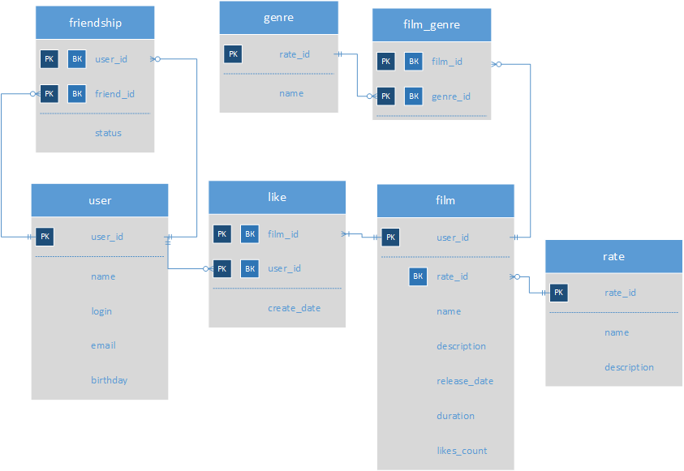

# java-filmorate
Template repository for Filmorate project.

# ER-диаграмма для БД filmorate

## Описание структуры БД

Основные сущности пользователей:
## 1) **user**

Содержит информацию о пользователях.
Таблица включает такие поля:
* первичный ключ *user_id* - идентификатор;
* *email* - адрес электронной почты;
* *login* - логин пользоватлеля;
* *name**- имя;
* *birthday* - дата рождения;

## 2) **frienship**

Содержит информацию о друзьях.
Таблица включает такие поля:
* *user_id* - идентификатор пользователя(часть составного первичного ключа) внешний ключ на таблицу user;
* *friend_id* - идентификатор друга(часть составного первичного ключа) внешний ключ на таблицу user;
* *status* - статус заявки на дружбу(false — когда один пользователь отправил запрос на добавление другого пользователя в друзья,
  true — когда второй пользователь согласился на добавление);

Связь между таблицами **user** и **frienship** один-ко-многим.

## 3) **like**

Содержит информацию о лайках.
Таблица включает такие поля:
* *film_id* - идентификатор фильма(часть составного первичного ключа) внешний ключ на таблицу film;
* *user_id* - идентификатор пользователя, который оставил лайк(часть составного первичного ключа) внешний ключ на таблицу user;
* *create_date* - дата создания лайка;

Связь между таблицами **film** и **like** по полю *film_id* один-ко-многим.

Связь между таблицами **user** и **like** по полю *user_id* один-ко-многим.

## 4) **rate**

Содержит информацию о рейтингах Ассоциации кинокомпаний.
Таблица включает такие поля:
* *rate_id* - идентификатор рейтинга(первичный ключ);
* *name* - название рейтинга(например, G);
* *description* - описание(например, у фильма нет возрастных ограничений);

## 5) **genre**

Содержит информацию о жанрах.
Таблица включает такие поля:
* *genre_id* - идентификатор жанра(первичный ключ);
* *name* - название жанра(например, Комедия);

## 6) **film**

Содержит информацию о фильмах.
Таблица включает такие поля:
* *film_id* - идентификатор фильма(первичный ключ);
* *name* - название жанра;
* *description* - описание;
* *release_date* - дата выхода фильма;
* *duration* - продолжительность;
* *likes_count* - количество лайков;
* *rate_id* - рейтинг фильма(внешний ключ на таблицу rate);

Связь между таблицами **rate** и **film** по полю *rate_id* один-ко-многим.

## 6) **film_genre**

Содержит информацию о том каким жанрам принадлежит фильм.
Таблица включает такие поля:
* *film_id* - идентификатор фильма(часть составного первичного ключа) внешний ключ на таблицу film;
* *genre_id* - идентификатор фильма(часть составного первичного ключа) внешний ключ на таблицу genre;

Связь между таблицами **film** и **film_genre** по полю *film_id* один-ко-многим.

Связь между таблицами **genre** и **film_genre** по полю *genre_id* один-ко-многим.
